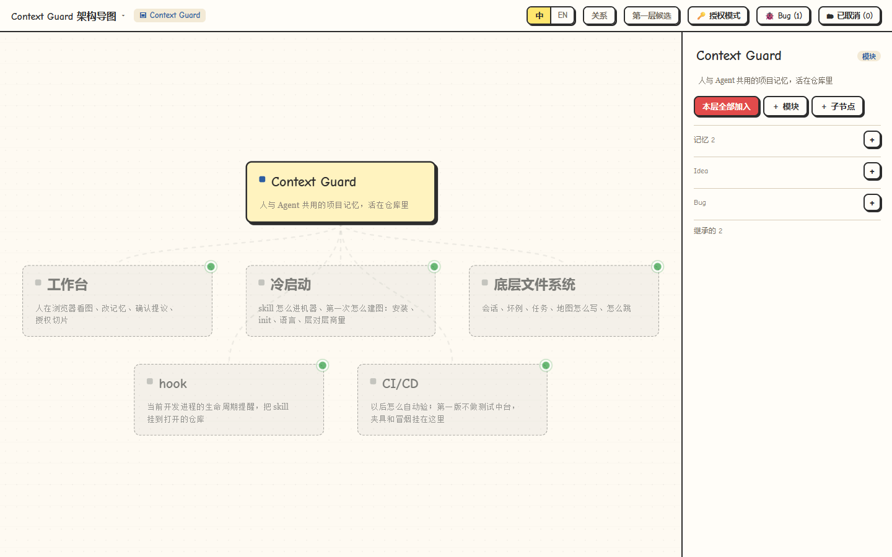
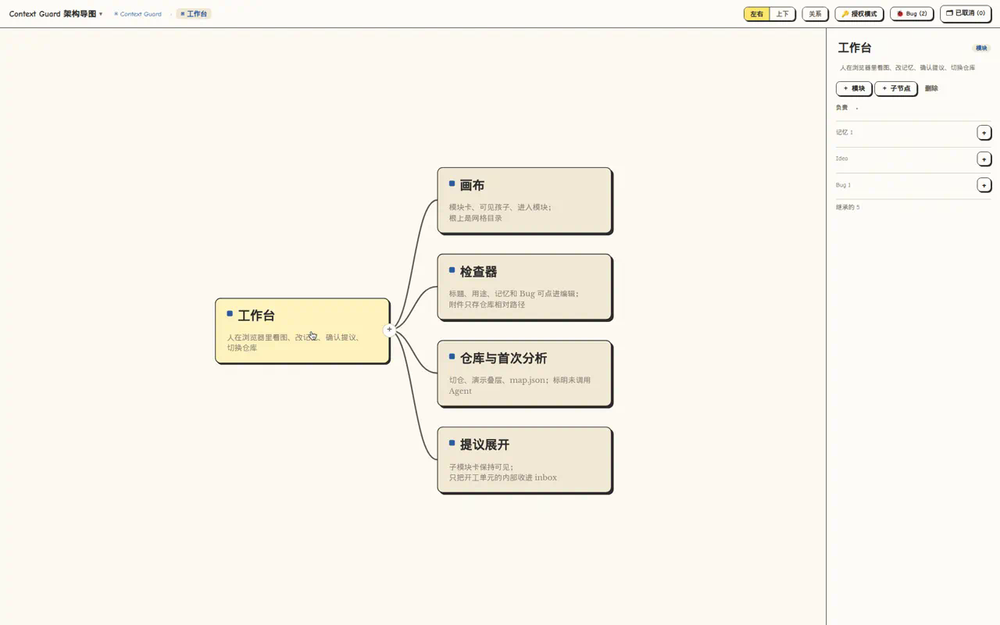
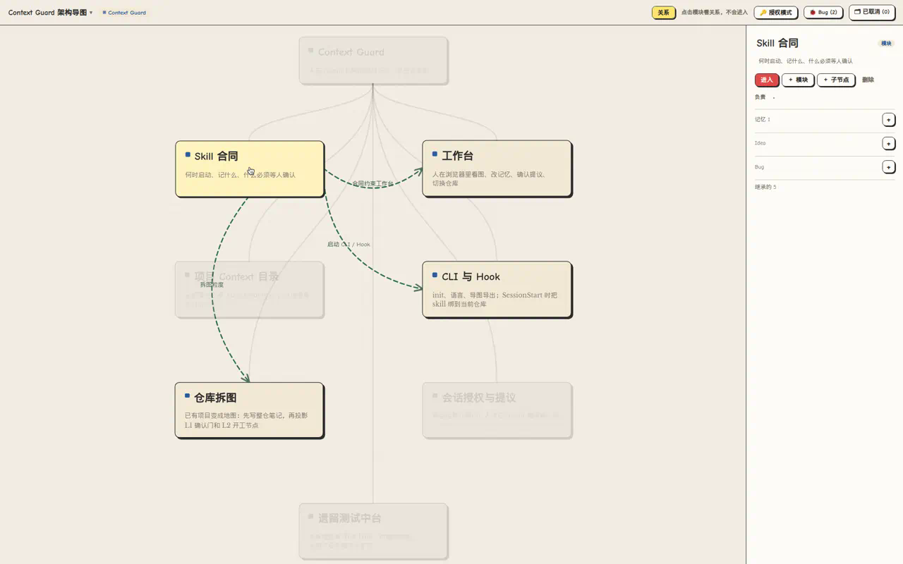
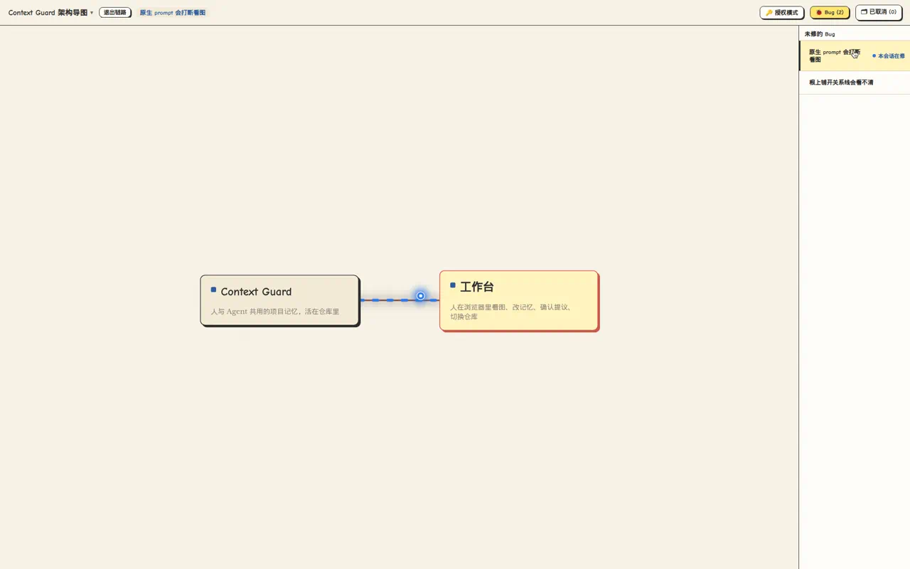
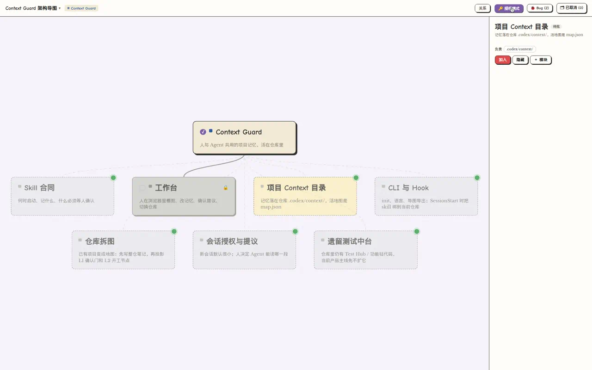

[Website & interactive demos](https://michel-johnson.github.io/Context-Guard-Skill/?lang=en)

# Context Guard Skill

Language: **English** | [中文](README.zh-CN.md)

Context Guard is a durable project-memory skill for Codex, Cursor, and Claude. It keeps the task route, branches, bad cases, and verification paths inside the project's own `.codex/context/` folder, so agents can understand where the work is, what went wrong before, and how to avoid repeating fixed mistakes across sessions.

## What It Does

- **Four stores**: sessions, bugs, tasks, map — with local drafts/caches in the opened project’s `.codex/context/`
- **First-use map**: the agent and the human decide the first layer together (several candidate cuts, then lock L1), then L2, then L3. Titles must be instantly readable. Later sessions open that map
- **Human workbench**: people confirm in `prototype/workbench.html`. Agents read small indexes, not the whole map
- **User wording**: durable prompts go in `user-messages.md`; secrets stay under `private/`
- **Record language**: Chinese or English per project, shared by its linked worktrees
- **Lifecycle**: create session records, retain user messages, and persist agent-identified bad cases through one command

v1 does **not** include Roadmap HTML, Test Hub, or feature chains.

## Human workbench

People look at the map in `prototype/workbench.html`. Agents read the small indexes under `.codex/context/`; they do not drive the canvas.

**Cloud:** the Cloud home page is a directory of independent project Maps. Public pages are read-only. An authorized Cloud workbench can edit a project, and each project uses its own sync token and ordered event stream rather than the administrative credential.

**Local:** every lifecycle reply first verifies the actual Session binding. An unbound Session first checks the global live inventory and offers the matching readable named URL; it still waits for confirmation and does not initialize a Map, start a service, or auto-open a browser. After confirmation, linked worktrees reuse one project service while their Session views remain isolated. A private global registry outside the replaceable Skill install preserves project URLs and bindings across upgrades; live probes keep registered, running, stopped, legacy and duplicate states distinct, and a temporarily unavailable bound Session self-repairs by project identity instead of asking again.

**Development policy for this repository:** source code follows the existing
branch/PR rules into GitHub main; the entire `.codex/` tree stays out of Git and
release artifacts. All development memory must come from the user-designated
private server, with local caches and isolated Session records. All Sessions reads
the server's committed-main baseline. The private service/client and local
acceptance tests are implemented; real deployment, native Hook trust verification,
and historical migration remain pending separate approval. See [the memory contract](references/server-memory.md).
Other projects do not automatically inherit this repository's server configuration.

```bash
context-guard workbench --binding-status --root /path/to/project --session <actual-session-id>
context-guard workbench --list --root /path/to/project
context-guard workbench --root /path/to/project --session <actual-session-id> --workbench-url http://project-name.localhost:1355/prototype/workbench.html
context-guard workbench --diagnose --root /path/to/project --session <actual-session-id>
# only after explicit confirmation to move an existing binding:
context-guard workbench --root /other/worktree --session <actual-session-id> --rebind
context-guard workbench --root /path/to/project --stop
```

Local URLs default to `http://project-name.localhost:1355` (a subsequent free port
is used if occupied), with no global Portless installation. Binding verifies the
named URL, Git project, backend instance, and runtime before persisting; returned
URLs pin the selected Session and never auto-switch to a newer active task. Explicit
`workbench bind --root <worktree> --project-root <existing-map-worktree>`
selects a service target without merging Maps or replacing the required Session
binding. Session records remain isolated in their own worktrees. Diagnose old or
duplicate services first; explicit migration backs up their private context and
signals only the reviewed `pid:instance` identities without force-killing them.
See [named workbenches](references/named-workbench.md) and
[Portless attribution](THIRD_PARTY_NOTICES.md); Apache-2.0 notices ship with the package.

The workbench chrome is Chinese or English. Open **Settings** on the far right of the top bar for language and theme. Map titles, purposes, and memories stay in the language they were written.

### Overview

Root catalog: 4–8 module cards. Click a card to enter. Bugs stay in the right-hand list.



### Inside a module

Work units hang under the module. Hierarchy is parent–child solid curves.



### Module relations

「关系」 highlights produce/consume partners and dims the rest. It does not enter the module.



### Session flow

Click a bug with an assigned session. The path from the root to that node lights up; current session beads run along the chain.



### Auth / inspect mode

「授权模式」 marks which slices this session’s agent may read. Grey cards are not authorized.



## Install

Install with npx. The installer detects Codex, Cursor, and Claude, then installs both the skill and lifecycle hooks while preserving existing configuration:

```bash
npx @michelj/context-guard install
```

Or install globally and let the package configure detected clients automatically:

```bash
npm install -g @michelj/context-guard --registry=https://registry.npmjs.org
```

Force installation for all three clients:

```bash
npx @michelj/context-guard install --platform all
```

Hooks are installed by default. To copy only the skill, opt out explicitly:

```bash
npx @michelj/context-guard install --no-hooks
```

Default skill paths are `~/.codex/skills/context-guard`, `~/.cursor/skills/context-guard`, and `~/.claude/skills/context-guard`. The installer backs up and merges existing hook/settings files. For Codex it also enables `[features] hooks = true` and migrates the deprecated `codex_hooks` alias.

Use from GitHub before the npm package is published:

```bash
npx github:Michel-Johnson/Context-Guard-Skill install
```

Manual install is also supported:

```bash
git clone git@github.com:Michel-Johnson/Context-Guard-Skill.git
cd Context-Guard-Skill
mkdir -p ~/.codex/skills/context-guard
rsync -a --delete \
  SKILL.md README.md README.zh-CN.md agents prototype references scripts \
  ~/.codex/skills/context-guard/
```

After installation, the matching clients should discover:

```text
~/.codex/skills/context-guard/SKILL.md
~/.cursor/skills/context-guard/SKILL.md
~/.claude/skills/context-guard/SKILL.md
```

## Publishing

GitHub Releases are not part of this package's delivery path. Users install the skill from npm, so publishing is driven by a version tag:

1. Update `package.json` to the next stable version and merge that commit into `main`.
2. Create the matching `vX.Y.Z` tag on that commit.
3. Push the tag. `.github/workflows/npm-publish.yml` validates, packs, smoke-tests, and publishes that exact tarball to npm.

The workflow has no manual trigger. Pushing a matching version tag starts the complete publish pipeline automatically; the validated tarball is retained as a GitHub Actions artifact for 14 days. It reuses npm Trusted Publishing for `Michel-Johnson/Context-Guard-Skill`, workflow filename `npm-publish.yml`, with the `npm publish` action allowed. Local npm login is not required for Actions publishing. See the [release and recovery runbook](https://github.com/Michel-Johnson/Context-Guard-Skill/blob/main/docs/npm-release-runbook.md).

## Where Context Lives

Context stays under the opened local project, independent of the client:

```text
<project root>/.codex/context/
```

Do not write project context into:

- the skill install directory
- a chat/thread directory
- a temporary directory
- an SSH remote server path

Short user prompts that matter for future work are kept in:

```text
<project root>/.codex/context/user-messages.md
```

If the user provides a credential that future turns need, Context Guard records only a redacted pointer in public context. Raw durable secrets must stay local-only under:

```text
<project root>/.codex/context/private/
```

When running scripts manually, pass the project root:

```bash
python3 scripts/context_guard.py init --root /path/to/project
python3 scripts/context_guard.py set-language --root /path/to/project --language English
```

On the first session, if `record_language` is still `unset`, the hook instructs the agent to ask “中文 or English?” and persist the answer. Later sessions do not ask again. The `workbench` command starts the local server and returns its browser URL.

## Common Usage

```text
Use $context-guard. Four stores: sessions, bugs, tasks, map.
```

```bash
python3 scripts/context_guard.py init --root /path/to/project
python3 scripts/context_guard.py set-language --root /path/to/project --language English
python3 scripts/context_guard.py workbench --root /path/to/project
context-guard doctor --platform codex --root /path/to/project
```

Run `context-guard workbench --root /path/to/project` to see the map. The top bar uses `platform-thread-name` (for example, `codex-basic`) while the session ID remains an internal identifier; Settings can switch sessions and grants are persisted across workbench restarts. Use `record-bad-case --session ...` and `record-bad-case-fix` for the minimal failure/fix loop and `write-candidates --input ...` for validated first-use L1 candidates. `archive-session --files ...` saves durable Session results and adds the summary to accepted Map nodes covered by `owns`. Unowned files remain unclassified. Use `archive-session --input ...` to explicitly assign support files to an existing node or submit an evidence-backed new-node proposal for human confirmation.

Codex installs eleven lifecycle hooks (excluding `SessionEnd`). They deliver the real Map, grants, assigned TODOs/Bugs, and other-session changes to the Agent at reasoning boundaries; run Cloud Sync `prepare` only at the first mutation of a plan; and check conflicts before requiring `sync finish`. New user requirements are classified semantically into Map TODOs. `TODO.md` stays human-owned. Hook events carry stable IDs and occurrence/recording timestamps.

## Main Files

```text
.codex/context/
|-- FIND.md
|-- sessions.jsonl
|-- sessions/
|-- bugs-index.json
|-- bugs/ and fixes/
|-- tasks/
|-- map.json
|-- owns-index.json and cards/   # generated
|-- preferences.json
|-- user-messages.md
`-- private/                     # gitignored
```

See [`SKILL.md`](SKILL.md) (one page) and `.codex/context/FIND.md`.

## Local workbench synchronization

Node now owns local map submissions, live page updates, and attachments. In a served workbench, human uploads are written as unique files under `docs/shots/`; the browser no longer needs project-directory permission, and only map-referenced files can be downloaded through the attachment endpoint. Use `context-guard map read` and `map apply` with an actual session ID, a base version and a stable operation ID. Browser cache is recovery-only; static pages are read-only. Python remains required for hooks and context initialization. See [the interface and migration guide](references/workbench-interface.md).

## Cloud event synchronization

Cloud Sync receives project-scoped SSE events instead of periodically replacing every Map. Run `context-guard sync prepare` before development and `context-guard sync finish` after verification. Disjoint changes rebase; overlapping node, field, or file scopes return `WORK_IMPACT` and stay unverified. See the [Cloud Sync interface](references/cloud-sync-interface.md).

To install Cloud on a new Linux server, create project credentials, connect working copies, or move the service to another host, follow the [Cloud deployment guide](references/cloud-deployment.md). Cloud stays in this repository; its persistent data and secrets stay outside the Git checkout.
