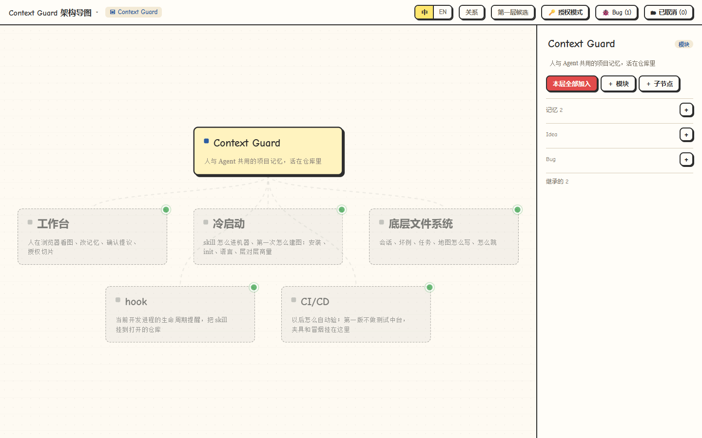
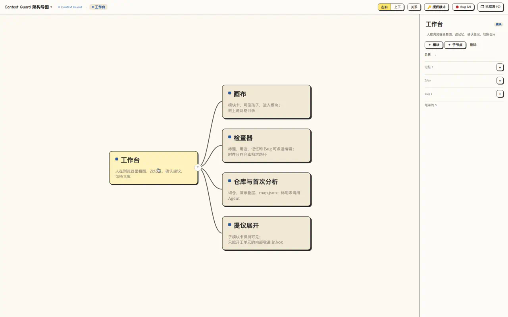
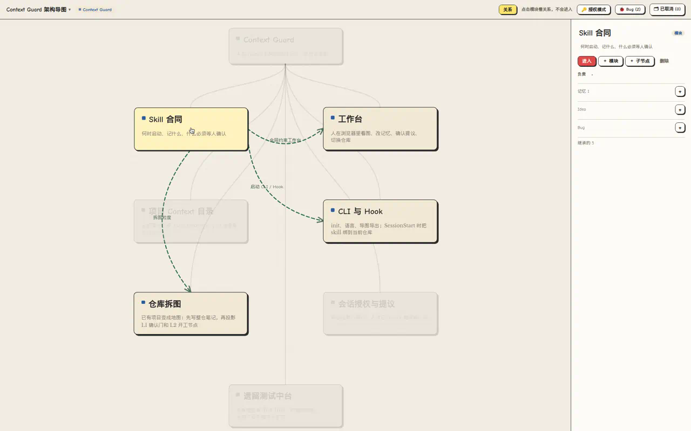
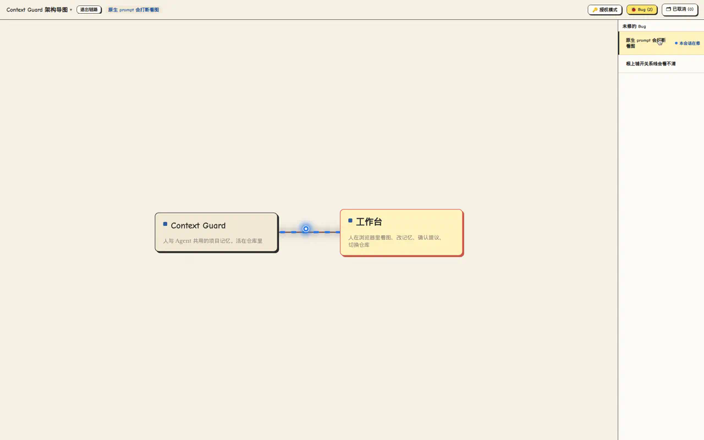
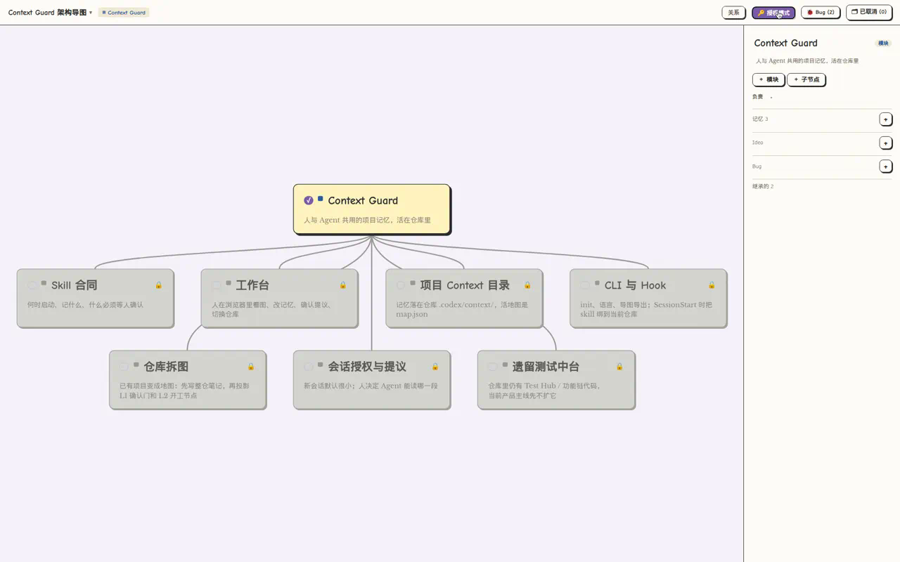

[官网与交互演示](https://michel-johnson.github.io/Context-Guard-Skill/?lang=zh)

# Context Guard

**下一代人与编码 Agent 的协作层。**

用共享 Map 组织模块、职责、记忆、Bug 和待办，让不同编码 Agent 接续项目。Coordinator 与人讨论需求，Executor 实现，Tester 验证；角色文本不等于工具权限。

Main 是共享基线，Session 是隔离草稿，人审核后的结果才发布进 Main。挂载不写 Main，执行 Session 需等指定 brief 获批；人仍可直接编辑 Main TODO。当前投入与暂缓范围见 [当前开发方向](development-docs/current-focus.md)，不把历史实现当作完整验收。

[文档入口](development-docs/README.md) · [Agent 使用入口](SKILL.md)

## 看工作台

工作台支持模块下钻、关系高亮、Bug/TODO、会话链路和授权模式；顶栏“设置”切换语言与主题，Map 正文保留写入语言。灰卡切片不是当前默认。

| 功能 | 说明 |
| --- | --- |
| 总览 | 第一层 4–8 张主干模块卡，未修 Bug 在右侧 |
| 模块 | 进入卡片查看所属工作项 |
| 关系 | 高亮生产/消费伙伴，不进入伙伴模块 |
| 会话 | 点关联 Bug 展示根到节点的链路 |
| 授权 | 查看与设置切片；新 Session 默认看自己的 Session Map |







配置 Cloud 后使用云端人类前端，本地后端负责同步与宿主投递；无 Cloud 则复用本地工作台。私有 Cloud 由人在浏览器登录，后续 Session 复用项目连接。首次配置、身份歧义或迁移已有绑定时才要求选择。

## 安装

```bash
npx @michelj/context-guard install
```

| 需要什么 | 命令 |
| --- | --- |
| 全局安装 | `npm install -g @michelj/context-guard --registry=https://registry.npmjs.org` |
| 强制三客户端 | `npx @michelj/context-guard install --platform all` |
| 只装 Skill、不启用 Hook | `npx @michelj/context-guard install --no-hooks` |
| npm 发布前从 GitHub 安装 | `npx github:Michel-Johnson/Context-Guard-Skill install` |

安装器检测 Codex、Cursor、Claude，备份并安全合并现有配置。默认装 Hook；Codex 会启用 `[features] hooks = true` 并装 11 个生命周期 Hook（不含 `SessionEnd`）。安装路径为 `~/.codex/skills/context-guard`、`~/.cursor/skills/context-guard`、`~/.claude/skills/context-guard`，客户端从中发现 `SKILL.md`。安装现有 Hook 不代表恢复暂缓开发，也不代替宿主信任确认。

```bash
context-guard workbench --root /path/to/project --session <真实-session-id>
context-guard doctor --platform cursor --root /path/to/project
```

默认本地入口为 `http://项目名.localhost:1355`；绑定固定项目、后端和 Session，不随其他任务切换。命令及排错见 [启动与绑定](skill-reference/design/design-interface-v1.2.1.md#启动与绑定)。

## 一轮怎么走

1. 在已有 Map 定位职责；首次建图由人确认层级与名称。
2. 绑定真实 Session，读取授权范围；记录语言未设定时先确认中文或英文。
3. Coordinator 与人确认需求；manual 保存 Main 事项及执行提示，automatic 的既有流程另见 [交接指南](skill-reference/agent-handoff.md)。
4. Executor 按需 `map read`，授权写入用 `map apply` 并带已读版本与稳定操作 ID；不把聊天附和当 Map 写入。
5. 核对实现、独立测试和人类验收，再按协议发布。Session 草稿或传输成功不等于 Main 发布。

开发笔记只保存本地，不同步 Cloud；`archive-session`、文件归属及旧兼容行为见 [归档接口](skill-reference/design/design-interface-v1.2.1.md#归档与-map-对齐)。Bug 记录与修复分别用 `record-bad-case` / `record-bad-case-fix`；`TODO.md` 由人维护。

## 云端

[Cloud](https://github.com/Michel-Johnson/Context-Guard-Cloud) 是可选扩展，负责托管、账号权限、多设备、云端模型和 Slack；共享核心与 UI 只在 Skill 维护，Cloud 固定包消费，见 [仓库边界](development-docs/repository-boundaries.md)。

同步使用项目级 SSE，不做定时全量覆盖；`sync prepare` / `sync finish` 同步结构化 Map，不上传会话笔记。不相交变更可重放，重叠节点、字段或文件返回 `WORK_IMPACT` 并保持未验证。连接、冲突与发布见 [Cloud Map](skill-reference/design/design-memory-server-v1.1.0.md)。

## 文档

用户与 Agent 操作从 [SKILL](SKILL.md) 和 [角色入口](roles/README.md) 开始；仓库开发从 [AGENTS](AGENTS.md)、[RULE](RULE.md) 开始；其他资料见 [文档索引](development-docs/README.md)，发布见 [发布手册](development-docs/npm-release-runbook.md)。

源码、产品文档和正式测试在 GitHub main；整个 `.codex/` 不进入 Git 或 npm。本仓库的私有服务器配置不由其他项目继承。Cloud 项目的本地文件只是缓存或草稿；fs-v2.1 是否已开放读取须核实际能力，不直接猜服务器磁盘路径。
